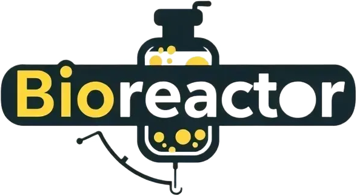

# BioReactor

BioReactor is a comprehensive web application dedicated to providing complete and actionable information on nutrients, foods, and their synergistic relationships. This project demonstrates my ability to create detailed, user-focused solutions that empower individuals to make informed decisions about their health and well-being.
## Features
- Nutrient Profiles: Explore detailed profiles of a wide range of nutrients, including their composition and health benefits.
- Food Sources: Access a rich database of natural foods packed with essential nutrients.
- Nutrient-Food Synergy: Discover how specific nutrients and foods work together for optimal health benefits.
- Recommended Daily Dosages: Receive personalized recommendations for daily intake of key macronutrients and micronutrients.
- Supplement Recommendations: Coming soon—personalized supplement suggestions based on individual health goals.

## Architecture
BioReactor leverages a robust client-server architecture, featuring:

### Backend
- Developed with Java Spring Boot
- Provides secure RESTful API services
- Implements JWT token-based security and authentication
- Integrates with a MySQL database for efficient data storage and retrieval
### Frontend
- Built using HTML, CSS, and JavaScript
- Delivers a responsive user interface with dynamic content loaded via asynchronous requests

# BioReactor-CapStone
Java Spring Boot based REST API server that controls MySQL Database and perform HTTP request from the Frontend (Dynamic website running on Node.js with Express)

## License
BioReactor is licensed under the [MIT](https://choosealicense.com/licenses/mit/) License.
